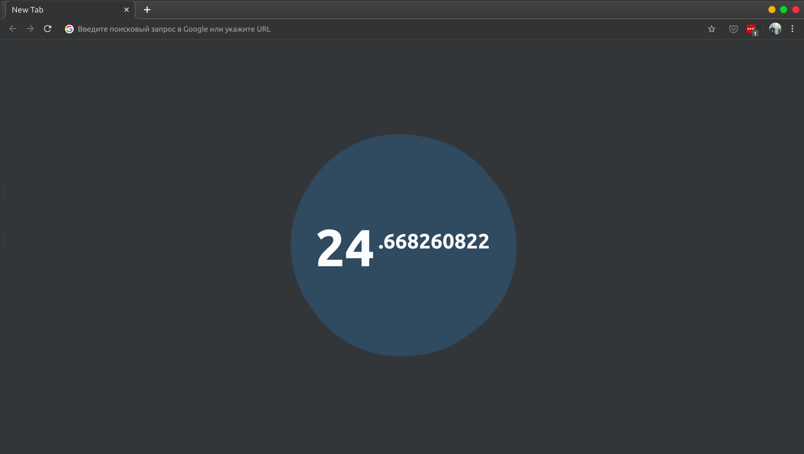
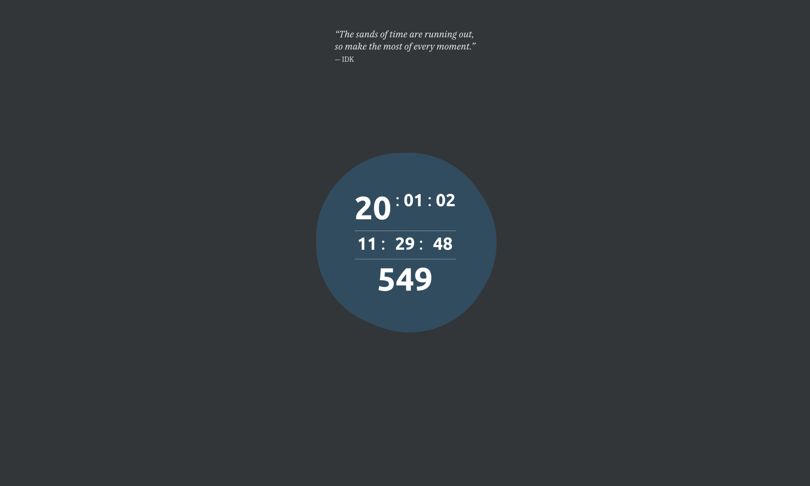

ExtraMotivation
========
A fork of [Lysak/Motivation](https://github.com/Lysak/motivation) extension with all time units instead of just year and fractions for extra ~~anxiety~~ motivation.

Install on firefox: https://addons.mozilla.org/en-US/firefox/addon/extramotivation/    
(or just load it from [extramotivation-1.0.0.zip](https://github.com/itsmohmans/motivation/blob/master/extramotivation-1.0.0.zip)).

On chrome, I guess you can load it as well from the same file, I haven't tested it but it should work. Let me know if there's any issue.

<!-- For Chrome add add-on from [chrome.google.com/webstore](https://chrome.google.com/webstore/detail/motivation/aliachjmgkelibfecomdccomahgpople/ "https://chrome.google.com/webstore/detail/motivation/aliachjmgkelibfecomdccomahgpople/")

 -->

<!-- For Firefox add add-on from [addons.mozilla.org](https://addons.mozilla.org/ru/firefox/addon/motivation-new-tab/ "https://addons.mozilla.org/ru/firefox/addon/motivation-new-tab/") -->

